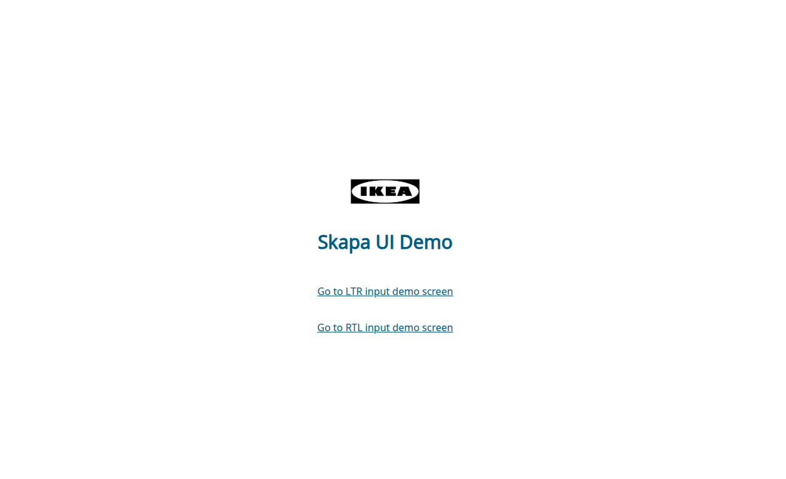
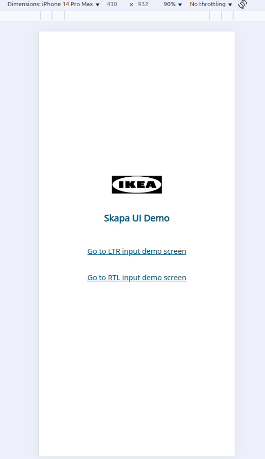
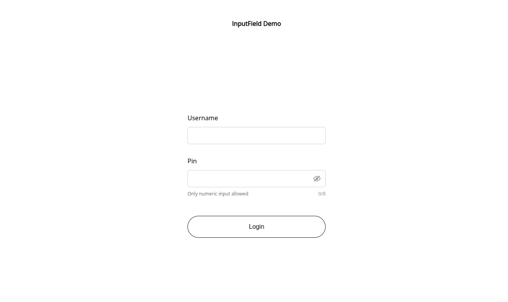
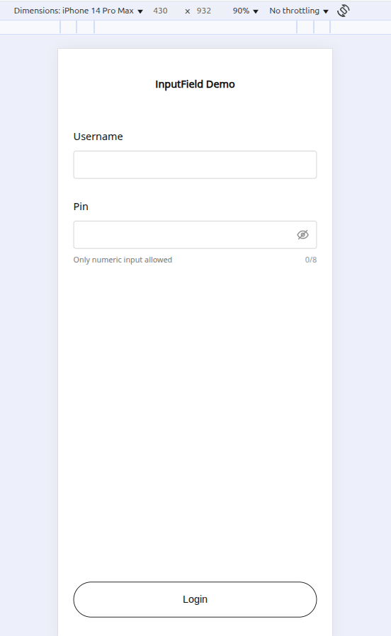
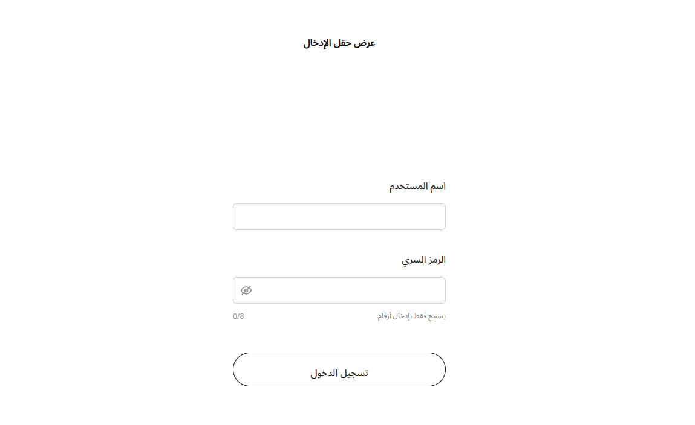
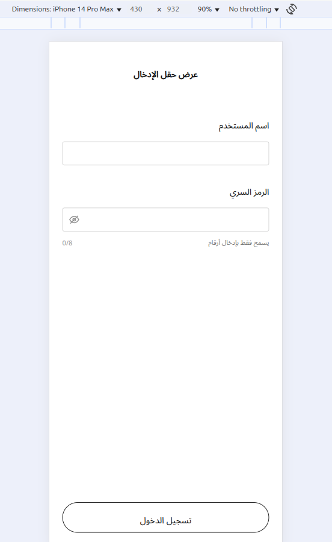

# Skapa Input Component

This project is part of the **IKEA Skapa technical challenge** and consists of an accessible, reusable input field component built with **React**, **TypeScript**, and **Vite**. It includes **Storybook** for UI documentation, **Jest** for unit testing, and **Docker** for containerized development and testing.

---

## 🛠️ Technologies Used

- [React 19](https://reactjs.org/)
- [TypeScript](https://www.typescriptlang.org/)
- [Vite](https://vitejs.dev/)
- [Storybook 8](https://storybook.js.org/)
- [Jest](https://jestjs.io/)
- [Testing Library](https://testing-library.com/)
- [Docker](https://www.docker.com/)

---

## 📦 Available Scripts

```bash
yarn dev             # Start Vite development server
yarn build           # Build for production
yarn preview         # Preview production build locally
yarn lint            # Run ESLint
yarn typecheck       # Run TypeScript type checking
yarn test            # Run unit tests with Jest
yarn test:watch      # Watch mode for tests
yarn test:coverage   # Generate test coverage report
yarn storybook       # Start Storybook at http://localhost:6006
yarn build-storybook # Generate static Storybook build
```
## 🐳 Docker
This project supports Docker for containerized development and testing.

`docker-compose.yml`

```bash
version: "3.8"

services:
  vite:
    build: .
    ports:
      - "5173:5173"
    volumes:
      - .:/app
      - /app/node_modules
    environment:
      - NODE_ENV=development

  storybook:
    build: .
    command: yarn storybook --ci
    ports:
      - "6006:6006"
    volumes:
      - .:/app
      - /app/node_modules
    environment:
      - NODE_ENV=development

  test:
    build: .
    command: yarn test
    volumes:
      - .:/app
      - /app/node_modules
    environment:
      - NODE_ENV=test

```

## 🐳 Running the Project with Docker

### Prerequisites
- Docker
- Docker Compose

### Start Vite dev server
The application for the project was developed with Vite, React, and TypeScript.

```bash
docker compose up vite
```
Open http://localhost:5173 in your browser.

### 📚 Start Storybook
The input component was documented in Storybook.

```bash
docker compose up storybook
```
Open http://localhost:6006 in your browser.

### ✅ Run Tests
Tests are written with Jest and Testing Library.

```bash
docker compose up test
```

### Start all containers
```bash
docker compose up --build
```
### Stop all containers

```bash
docker compose down
```

## 📸 Visual Demonstrations
Click on <b>Go to LTR input demo screen</b> to test the demo input with LTR support, or click on <b>Go to RTL input demo screen</b> to test the demo input with RTL support.

<table border="1">
  <tr>
    <th>Desktop Screen</th>
    <th>Cellphone Screen</th>
  </tr>
  <tr>
    <td></td>
    <td></td>
  </tr>
  <tr>
    <td></td>
    <td></td>
  </tr>
  <tr>
    <td></td>
    <td></td>
  </tr>
</table>


## 📁 Project Structure
<pre>
src
│   ├── components (application components)
│   │   └── common (reusable components)
│   ├── main.tsx
│   ├── pages (application pages)
│   │   ├── DemoLoginPage
│   │   └── Home
│   ├── routers (route configuration)
│   │   └── AppRouter.tsx
│   ├── stories (storybook stories)
│   │   ├── assets
│   │   ├── components
│   │   └── Configure.mdx
│   ├── styles (sass styles)
│   │   ├── abstracts (where media queries, utilities and sass variables are located)
│   │   ├── base (base settings and typography)
│   │   ├── components (component styles)
│   │   ├── main.scss
│   │   └── pages (page styles)
│   ├── tests (unit tests)
│   │   ├── components
│   │   └── pages
</pre>

## 📄 License

This project was developed by Gabriel Campos as part of the IKEA Skapa challenge. It is intended for educational and technical demonstration purposes only.
